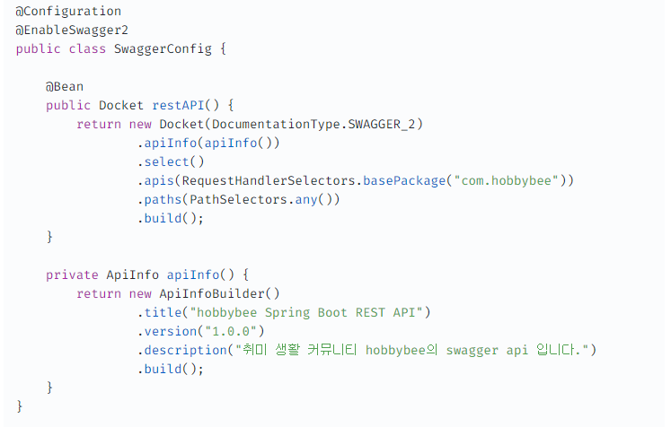

# ⭐ Swagger

> ## 📌 Swagger Config

* ### Annotations
  * @Configuration
  * @EnableSwagger2

* ### Options
  * apis()
    * 대상 패키지 설정
  * paths()
    * PathSelectors.any() or URL 지정

 

> ## 📌 Controller 적용

* ### 클래스레벨에 적용
  * @Api(tags = {"API 이름"})

* ### 메서드 레벨에 적용
  * @ApiOperation(value = "API Title", notes = "설명")