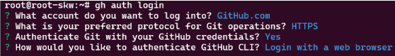

# ⭐ Git 정리

> ## 📌 Git 이란?

* 파일들의 변경사항 추적, 백업, 버전관리
* 공동작업물 취합

> ## 📌 Git SSH 등록

* cmd - ssh-keygen - public key 내용 복사
* github에 SSH Key 등록

* in Linux
  * curl -fsSL https://cli.github.com/packages/githubcli-archive-keyring.gpg | sudo dd of=/usr/share/keyrings/githubcli-archive-keyring.gpg
  * echo "deb [arch=$(dpkg --print-architecture) signed-by=/usr/share/keyrings/githubcli-archive-keyring.gpg] https://cli.github.com/packages stable main" | sudo tee /etc/apt/sources.list.d/github-cli.list > /dev/null
  * apt update
  * apt install gh dirmngr
  * gh auth login
  
  * CLI에서 받은 Code를 https://github.com/login/device 로 이동해서 인증
  * gh auth status & gh auth logout